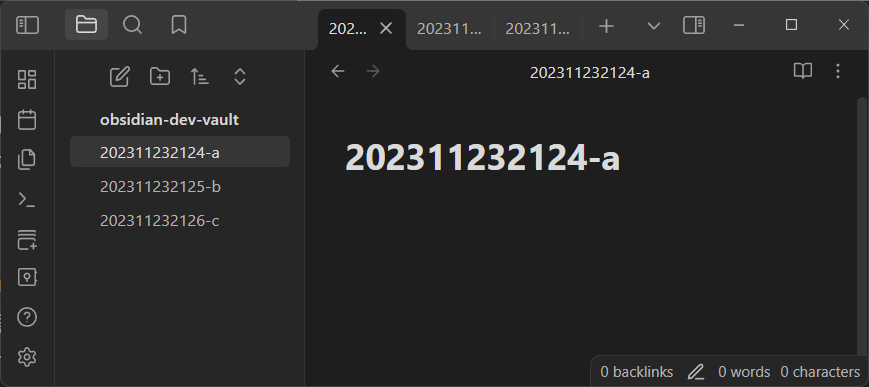
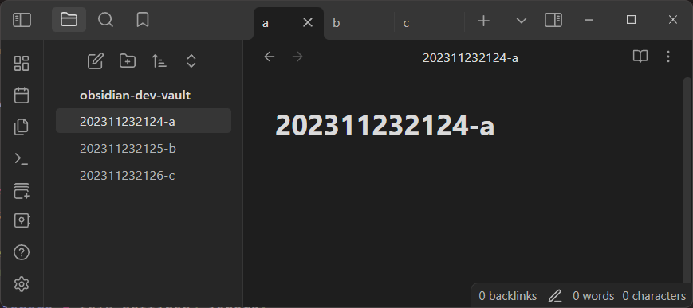

# Short Tab Name

This plugin hides filename header such as zettel uid from tab name.

You can setting hide range with regexp.

## Demo

### Images

### As character

|before|after|
|-|-|
|202311232124-a | a |
|202311232125-b | b |
|202311232126-c | c |

## Installation

### With Obsidian
- Open "Setting"
- Open "Community Plugins"
- Open "Browse"
- Search "short tab name"
- Push "Install"
- Push "Enable"
- Done :D

### Manually installing the plugin

- Copy over `main.js`, `styles.css`, `manifest.json` to your vault `VaultFolder/.obsidian/plugins/short-tab-name/`.

## How to use
just install this.

If your file-header is made from not only digits, 
you can try to make regexp pattern in setting.

### Examle

|ignore header regexp|sample file name| result tab name|
|-|-|-|
|(default)`[0-9]+-`|2222-aaaa|aaaa|
|`[0-9]+_`|2222_aabb|aabb|
|`.+-`|5a5a-name|name|

## License
The source code is licensed MIT.
See LICENSE.

## Say Thank you

If Short-Tab-Name makes your work more convinience ,
then please give me a coffee :D

links are below.

[https://www.buymeacoffee.com/s6tanaka](https://www.buymeacoffee.com/s6tanaka)

[https://www.paypal.me/s6tanaka/](https://www.paypal.me/s6tanaka/)

