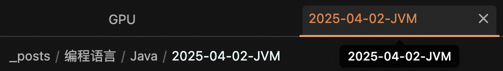
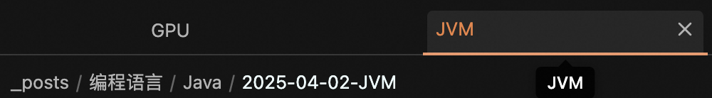

# Title-only Tab

This plugin set tab name to the value for `title` attribute in the YAML frontmatter for Jekyll users.

Before:

After:

Many thanks to Tanaka Shumpei and his project [Shumpei-Tanaka/obsidian-short-tab-name: a plugin of obsidian for to change showing tab name to short](https://github.com/Shumpei-Tanaka/obsidian-short-tab-name)!
